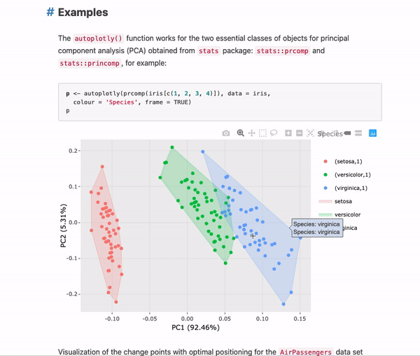

**Note**: This package has been maintained by [@terrytangyuan](https://github.com/terrytangyuan) since 2017. Please [consider sponsoring](https://github.com/sponsors/terrytangyuan)!

[](https://cran.r-project.org/package=autoplotly)
[](https://zenodo.org/badge/latestdoi/116608209)
[](https://doi.org/10.21105/joss.00657)

# autoplotly

This R package provides functionalities to automatically generate interactive visualizations for many
popular statistical results supported by [ggfortify](https://github.com/sinhrks/ggfortify)
package with [plotly.js](https://plot.ly) and [ggplot2](http://ggplot2.tidyverse.org/) style.
The generated visualizations can also be easily extended using ggplot2 syntax while staying interactive. 



You can play the examples interactively [here](https://terrytangyuan.github.io/2018/02/12/autoplotly-intro/).

## Installation

To install the current version from CRAN, use:

``` r
install.packages("autoplotly")
```

To install from development version on Github, use:

``` r
devtools::install_github("terrytangyuan/autoplotly")
```

## Example

``` r
# Automatically generate interactive plot for results produced by `stats::prcomp`
p <- autoplotly(prcomp(iris[c(1, 2, 3, 4)]), data = iris,
  colour = 'Species', label = TRUE, label.size = 3, frame = TRUE)

# You can apply additional ggplot2 elements to the generated interactive plot
p +
  ggplot2::ggtitle("Principal Components Analysis") +
  ggplot2::labs(y = "Second Principal Components", x = "First Principal Components")

# Or apply additional plotly elements to the generated interactive plot
p %>% plotly::layout(annotations = list(
  text = "Example Text",
  font = list(
    family = "Courier New, monospace",
    size = 18,
    color = "black"),
  x = 0,
  y = 0,
  showarrow = TRUE))
```

You can `autoplotly` many other statistical results automatically with the help of [ggfortify](https://github.com/sinhrks/ggfortify). A complete list can be found [here](https://github.com/sinhrks/ggfortify#coverage).

## Reference/Citation

To cite `autoplotly` in publications, please use the following (available via `citation("autoplotly")`):

> Yuan Tang (2018). autoplotly: An R package for automatic generation of interactive visualizations for statistical results. Journal of Open Source Software, 3(24), 657, https://doi.org/10.21105/joss.00657
> 
> Yuan Tang, Masaaki Horikoshi, and Wenxuan Li (2016). ggfortify: Unified Interface to Visualize Statistical Result of Popular R Packages. The R Journal, 8.2, 478-489.
